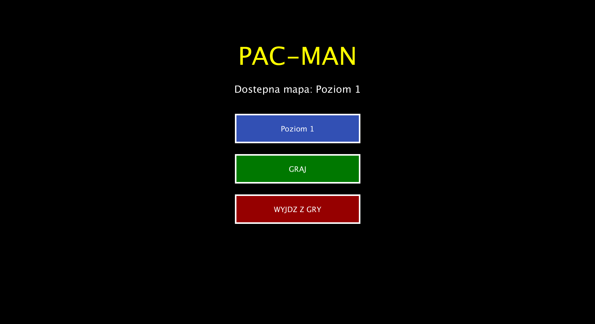
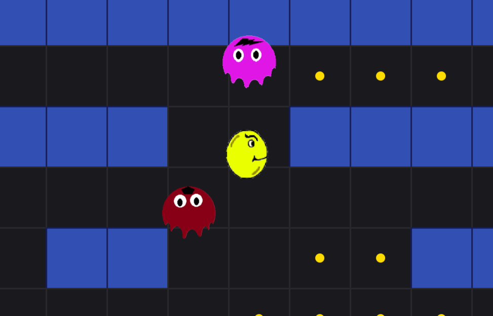
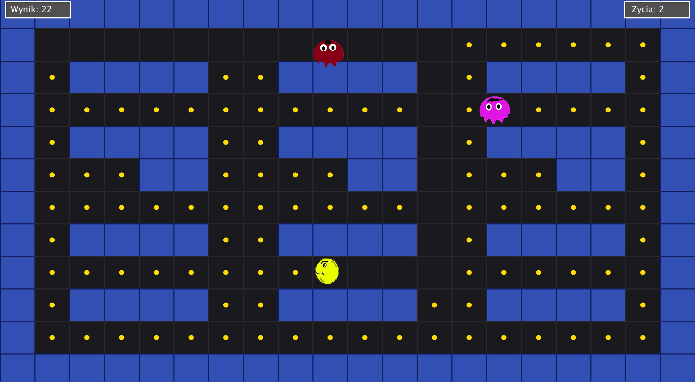
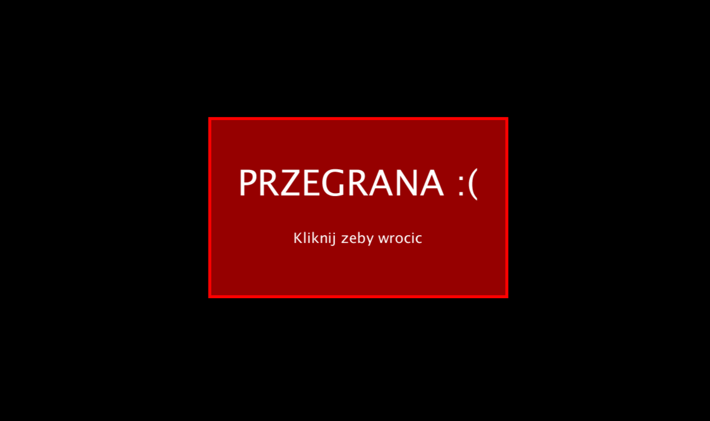
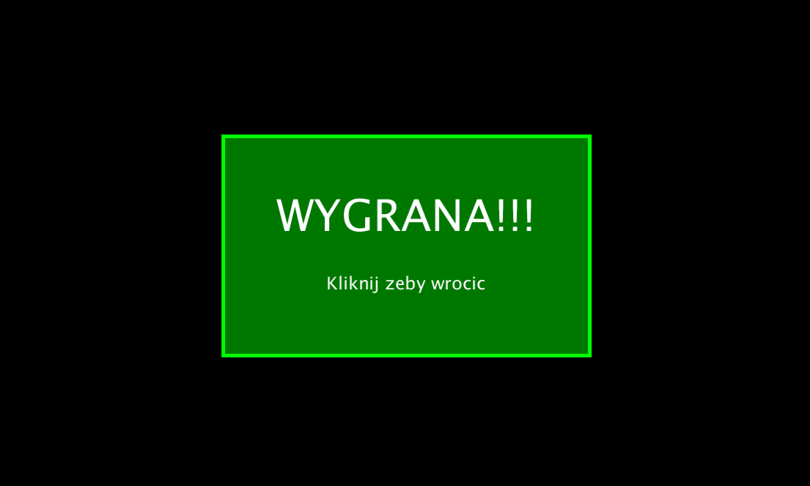

# Pac-Man (Processing / Python Mode)


A custom recreation of the classic Pac-Man game, built as a team course project (5 students) using **Processing** with **Python Mode**.

## Description

The player navigates a maze, collects coins and avoids enemies. The game features a simple menu system, two selectable levels of different difficulty, multiple enemy types with different behaviors, a lives system, and win/lose end screens.

## Features

- Two selectable maps (easier / harder), each with a unique layout
- Two enemy types with different movement logic: random wandering and player-hunting
- Collision system between player, enemies, walls and coins
- Player has 3 lives (hearts); losing all lives ends the run
- Animated main character with directional sprite rotation
- Coin counter and win condition (collect all coins on the map)
- Menu / Game / Game Over / Level Complete state machine
- End screens showing the final score

## Controls

<!-- TODO: уточнить точные клавиши в коде (стрелки / WASD) и вписать сюда -->
- Arrow keys / WASD — move the character
- Menu navigation — mouse or keyboard (see in-game menu)

## My Contribution

<!-- TODO: 3-5 предложений от первого лица о твоём личном вкладе (см. README на польском для деталей) -->
- Set up the repository structure and multi-file project layout
- Implemented the main character, its sprites and movement system
- Built the base map and coin collection logic
- Added character animation and refined the UI, including the coin counter
- Reviewed and integrated code from teammates, cleaned up redundant code

## Technologies

- **Language:** Python (Processing Python Mode / Jython)
- **Engine:** Processing 4
- **Concepts used:** OOP (Player, Ghosts, Level classes), finite state machine (menu/game/game over/win), collision detection, sprite animation

## Architecture

```
Main/
├── main.pyde      # entry point, game state machine, main draw/update loop
├── level.py       # level/map loading and rendering
├── menu.py        # menu screen and navigation
├── objects.py     # Player, RandomGhost, HunterGhost classes
└── data/          # sprites (Pacman, ghosts)
```

## Installation

**Requirements**
- [Processing 4](https://processing.org/download)
- Python Mode plugin for Processing (Contribution Manager → install "Python Mode")

**How to run**
1. Install Processing 4 and add the Python Mode plugin.
2. Clone this repository.
3. Open `Main/main.pyde` in Processing (with Python Mode selected).
4. Click **Run** (▶).

## Gallery

| Menu | Gameplay – Level 1 | Gameplay – Level 2 |
|---|---|---|
|  |  |  |

| Game Over | Win |
|---|---|
|  |  |
## Team

| Name | Contribution |
|---|---|
| Davyd Khomenko | Repository setup, code integration & cleanup, main character sprites & movement, project structure, base map & coin collection, character animation, UI polish, coin counting |
| Veronika Tykhonova | Coin system rework, character rotation by movement direction, bug fixing, full menu system, main file integration, win/lose end screens |
| Andriana Beichak | Enemy sprites, enemy behavior (random movement, chasing) with Nazar Yatskiv, collision system, team coordination |
| Nazar Yatskiv | Enemy movement system, testing & fixing enemy behavior (incl. collision/spawn bugs), game over screen, player lives system, post-hit invincibility |
| Bogdan Mikhnieiev | Second level/map, level selection, harder difficulty tuning, integration with new systems, enemy behavior on new level, level speed tuning |

Shared work: finite state machine for start/end screens, testing, hitbox tuning, commits.

## License

MIT — see [LICENSE](LICENSE).jedno życie. Jeśli wszystkie życia zostaną utracone, gracz przegrywa i może rozpocząć rozgrywkę ponownie z menu

Celem gry jest zebranie wszystkich monet znajdujących się na mapie. Po zakończeniu rozgrywki wyświetlany jest wynik informujący o liczbie zebranych monet oraz o tym, czy gracz wygrał czy przegrał.

Projekt został stworzony w celach edukacyjnych i pozwolił zespołowi przećwiczyć pracę grupową, projektowanie mechanik gry oraz implementację logiki rozgrywki.
